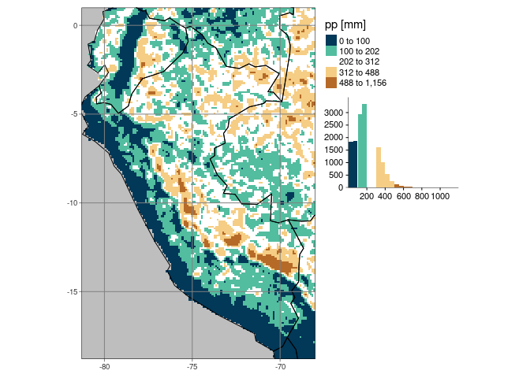

HOW TO CALCULATE CLIMATOLOGY FROM A GRIDDED DATASET
================

[](https://github.com/fernandoprudencio/taller-raster/commits/master)

Fernando Prudencio
August 17, 2020

## Load libraries

``` r
library(tidyverse)
library(Hmisc)
library(raster)
library(ncdf4)
library(tmap)
library(cptcity)
```

## Create time series within a dataframe

Before calculating the **climatology** of any variable, for a given
period (eg: **1981-2016**), first a time series field is created within
a dataframe, in addition to an identifier field **\[id\]**.

Build a data frame with a date field and an identity field for the
period from 1981 to 2016 (by month)

``` r
df <- tibble(
  date = seq(as.Date("1981-01-01"), as.Date("2016-12-01"), by = "1 month")
) %>%
  mutate(id = 1:n())
```

    ## # A tibble: 6 x 2
    ##   date          id
    ##   <date>     <int>
    ## 1 1981-01-01     1
    ## 2 1981-02-01     2
    ## 3 1981-03-01     3
    ## 4 1981-04-01     4
    ## 5 1981-05-01     5
    ## 6 1981-06-01     6

## Build a function to calculate climatology

In this step, we are going to build a function to calculate climatology
without considering years of extreme drought

``` r
fun.clim <- function(month, years.omit, data) {
  grd.mt <- df %>%
    filter(
      str_sub(date, 6, 7) == month &
        str_sub(date, 1, 4) %nin% years.omit
    )

  data[[grd.mt$id]] %>%
    "*"(1) %>%
    mean(na.rm = T) %>%
    return()
}
```

## Apply fun.clim function with sapply()

Apply **fun.clim** function to calculate average conditions between
january and december. Omitted years were 2005, 2010 and 2016, as
mentioned in ***Marengo and Espinoza (2016)***. For this example, we
going to use the Pisco v2.1 gridded precipitation dataset.

``` r
grd.clim <- sapply(
  sprintf("%02d", 1:12),
  FUN = fun.clim,
  years.omit = c(2005, 2010, 2016),
  data = brick("data/raster/pp/pisco-pp.nc")
) %>% stack() %>% "*"(1) %>%
  "names<-"(sprintf(month.abb))
```

    ## class      : RasterBrick 
    ## dimensions : 198, 133, 26334, 12  (nrow, ncol, ncell, nlayers)
    ## resolution : 0.09999998, 0.1  (x, y)
    ## extent     : -81.3, -68, -18.8, 1  (xmin, xmax, ymin, ymax)
    ## crs        : +proj=longlat +datum=WGS84 +no_defs 
    ## source     : memory
    ## names      :        Jan,        Feb,        Mar,        Apr,        May,        Jun,        Jul,        Aug,        Sep,        Oct,        Nov,        Dec 
    ## min values : 0.01531051, 0.06828829, 0.07635154, 0.00000000, 0.00000000, 0.00000000, 0.00000000, 0.00000000, 0.00000000, 0.00000000, 0.00000000, 0.00000000 
    ## max values :  1029.3501,  1155.5221,   951.1259,   867.9878,   519.9894,   430.6154,   284.2223,   296.0526,   339.5458,   581.7537,   596.5540,   753.7319

## Save climatology raster as .grd format

Save the climatology raster as **.grd** format to keep the name of the
bands (also see **netCDF** format)

``` r
writeRaster(grd.clim, "data/raster/pisco_clim.grd", overwrite = T)
```

## Plot average conditions for February

In this step, we going to use the tmap package and the **World** vector

``` r
data("World")
tmap_mode("plot")
tm_shape(grd.clim[["Feb"]]) +
  tm_raster(
    title = "pp [mm]",
    style = "kmeans", n = 5,
    palette = cpt(
      pal = "ncl_precip_diff_12lev", n = 100,
      colorRampPalette = FALSE, rev = T
    ),
    legend.hist = TRUE
  ) +
  tm_shape(World, bbox = World %>% filter(name == "Peru")) +
  tm_borders(col = "black") +
  tm_legend(outside = TRUE, hist.width = 2) +
  tm_grid(
    labels.inside.frame = FALSE,
    x = seq(-85, -65, 5),
    y = seq(-20, 5, 5),
    projection = "+proj=longlat"
  ) +
  tm_layout(bg.color = "gray")
```

<!-- -->
